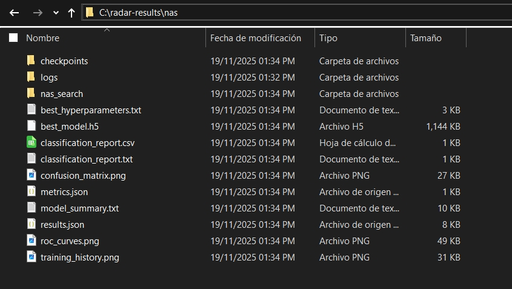

# Enhanced Radar Signal Classification with Neural Architecture Search

This project implements an advanced radar signal classification system with Neural Architecture Search (NAS) capabilities. It's specifically designed to distinguish between different types of radar signals, with special attention to differentiating between AM and PULSED signals.

## Index
1. [Features](#features)
2. [Project Structure](#project-structure)
3. [Installation](#installation)
4. [Usage](#usage)
   - [Run the NAS search with the following command:](#run-the-nas-search-with-the-following-command)
   - [Running Neural Architecture Search](#running-neural-architecture-search)
   - [Training with the Best Found Architecture](#training-with-the-best-found-architecture)
   - [Analyzing an HDF5 Dataset](#analyzing-an-hdf5-dataset)
5. [Configuration](#configuration)
6. [Results](#results)
7. [Model Recovery](#model-on-recovery)
8. [Run on Docker](#run-on-docker)
9. [Contributing](#contributing)
10. [License](#license)

## Features

- **Enhanced Data Handling**: Advanced preprocessing of radar signal data with spectrograms, wavelet transforms, and specialized features
- **Neural Architecture Search**: Automated discovery of optimal neural network architectures using:
  - Keras Tuner integration
  - Configurable search spaces
  - Multiple search strategies (Random, Bayesian, Hyperband)
- **Dual-Model Support**: 
  - TensorFlow-based deep learning models with attention mechanisms
  - Scikit-learn-based Random Forest models as fallback/comparison
- **Cross-Validation**: Robust evaluation with stratified k-fold cross-validation
- **Visualization**: Comprehensive visualization of results and model performance
- **Reproducibility**: Full logging and configuration management

## Project Structure

```
├── microcontroller/
│   ├── convert_model.py       # Convert Keras → TFLite and generate C header (model.h)
│   ├── model.tflite           # Generated TFLite model (example)
│   └── model.h                # C array with the TFLite model (example)
├── scripts/
│   ├── analyze_hdf5.py        # Analyze HDF5 datasets (distribution, shapes, memory estimation)
│   └── nas_search.py          # Script for running neural architecture search
├── src/
│   ├── __init__.py
│   ├── data_loader.py         # Loading and preprocessing (spectrogram); option to group AM as AM_combined
│   ├── model.py               # Base CNN classifier with regularization/anti-overfitting
│   ├── model_nas.py           # NAS wrapper and hypermodel construction
│   ├── train.py               # Training utilities and NAS flow via trainer
│   ├── utils.py               # Visualization and general utilities
│   └── nas/
│       ├── __init__.py
│       ├── search_space.py    # Search spaces: default/small/large/am_pulsed
│       ├── strategies.py      # Random/Bayesian/Hyperband strategies (Keras Tuner)
│       └── utils.py           # NAS utilities (plot_model, comparisons, analysis)
├── logging.conf               # Logging configuration
├── run_main_nas.py            # Simple NAS runner (Keras Tuner) using base DataLoader; defaults to results2/nas
├── nas_main.py                # Main entry point for NAS
├── recover_best_model.py      # Rebuilds and saves the best model from a specific trial
├── requirements.txt           # Project dependencies
└── README.md
```

## Installation

1. Create a virtual environment:
   ```bash
   python -m venv venv
   source venv/bin/activate  # On Windows: venv\Scripts\activate
   ```

2. Install dependencies:
   ```bash
   pip install -r requirements.txt
   ```

3. Windows Users: If you encounter UTF-8 encoding errors, enable UTF-8 support:
   - Press `Win + R`, type `intl.cpl`, and press Enter
   - Go to the **Administrative** tab → **Change system locale**
   - Check: **"Beta: Use Unicode UTF-8 for worldwide language support"**
   - Restart your computer

## Usage

### Run the NAS search with the following command:

```bash
python run_main_nas.py --dataset <path_to_dataset> --samples 5000 --combine_am --trials 20 --epochs 30 --batch_size 32 --strategy bayesian --use_attention --use_residual --augment_data
```

### Running Neural Architecture Search

```bash
python nas_main.py --train_dataset path/to/train.h5 --test_dataset path/to/test.h5 \
    --search_strategy bayesian --max_trials 50 --epochs 30
```

### Training with the Best Found Architecture

```bash
python main.py --train_dataset path/to/train.h5 --test_dataset path/to/test.h5 \
    --model_config best_model_config.json
```

### Analyzing an HDF5 Dataset

```bash
python scripts/analyze_hdf5.py --file path/to/dataset.h5 --output results/analysis \
    --analyze_signals --plot_examples
```

### Main Instruction
Use this instruction for running all the program at once, this runs the three actions before documented:
```bash
  python run_main_nas.py --dataset c:/datasets/RadComOta2.45GHz.hdf5 --samples 5000 --combine_am --trials 20 --epochs 30 --batch_size 32 --strategy bayesian --use_attention --use_residual --augment_data
```


## Configuration

The search spaces for NAS can be configured in `src/nas/search_space.py`. The following hyperparameters can be tuned:

- Network depth and width
- Attention mechanisms
- Convolutional layers (filters, kernel sizes)
- Regularization strategies
- Learning rates and optimizers
- Activation functions

## Results

Results are saved in the `results/` directory:

- `results/models/`: Saved model files
- `results/logs/`: Training logs and metrics
- `results/plots/`: Visualizations and performance plots
- `results/nas/`: Neural architecture search results

## Model Recovery

To recover and save the best model found during NAS:

```bash
python recover_best_model.py
```

This will:
1. Load the best model from the checkpoints
2. Save it as `best_simple_model.h5`
3. Display the model summary

## Run on Docker
1. First, install Docker in your system.
2. Run this script on terminal `docker build -r radar-nas .`
3. Download the ["Over the air version" dataset](https://www.androcs.com/uploads/RadComOta2.45GHz.zip)
4. Unzip the file in determined path like `c:/datasets`. This path is where the dataset is stored.
5. Create folder `c:/radar-results`. This path is where the output from the container will be saved.
5. Run this code on terminal to set the code in motion:

```bash
  docker run --rm -it `
    -v c:/datasets:/datasets `
    -v c:/radar-results:/app/results2 `
    radar-nas `
    python run_main_nas.py `
        --dataset /datasets/RadComOta2.45GHz.hdf5 `
        --samples 5000 `
        --combine_am `
        --trials 20 `
        --epochs 30 `
        --batch_size 32 `
        --strategy bayesian `
        --use_attention `
        --use_residual `
        --augment_data
```
6. Please wait until the process is complete.
7. Please check `c:/radar-results` to find the generated data.



## Contributing

1. Fork the repository
2. Create a feature branch
3. Commit your changes
4. Push to the branch
5. Create a Pull Request

## License

This project is licensed under the MIT License - see the LICENSE file for details.

